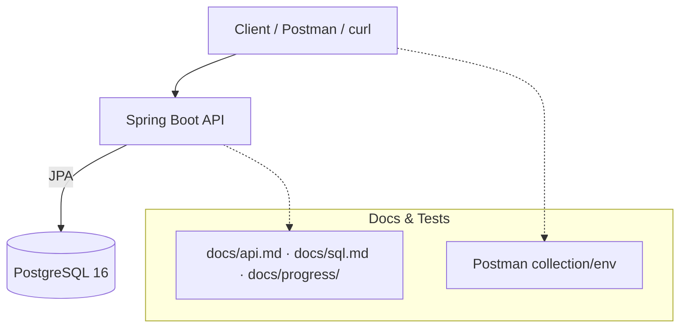

# Backend Portfolio

[](#)
[](#)
[](LICENSE)

Focused backend engineering growth — disciplined practice, traceable outcomes. This repository documents a structured journey to build mastery in **Java, SQL, REST APIs, and DevOps fundamentals** while developing professional workflow and portfolio discipline.

---

## 📑 Table of Contents

1. [⚡ Quickstart](#-quickstart)
2. [🧩 Project Snapshot](#-project-snapshot)
3. [🏗️ Architecture](#️-architecture)
4. [📚 API Overview](#-api-overview)
5. [🛠️ Configuration](#️-configuration)
6. [🧪 Postman](#-postman)
7. [🗄️ Database](#️-database)
8. [🗂️ Repository Structure](#️-repository-structure)
9. [🧭 How to Explore](#-how-to-explore)
10. [🔗 Useful Internal Docs](#-useful-internal-docs)
11. [🗺️ Development Phases Overview](#️-development-phases-overview)
12. [📅 Phase 1 — 14-Day Overview](#-phase-1--14-day-overview)
13. [🎯 Personal Mission Statement](#-personal-mission-statement)
14. [👤 Author](#-author)

---

## ⚡ Quickstart

### Option A — Full stack (API + DB via Docker)

```bash
docker compose up -d --build
# Verify:
curl -s http://localhost:8080/health
```

### Option B — Local app + Dockerized DB

```bash
# Start only Postgres
docker compose up -d db

# In another terminal, run the app locally
mvn -q spring-boot:run

# Verify:
curl -s http://localhost:8080/health
```

> More detail in `docs/api.md` (running modes) and `docs/sql.md` (DB tips).

---

## 🧩 Project Snapshot

* **Stack:** Java 21 · Spring Boot 3.x · Maven · PostgreSQL 16 · Docker Compose
* **Modules:** Health endpoint · `/items` CRUD (DTO validation, error handling)
* **Tooling:** Postman collection & environment · docs under `docs/` (API, SQL, progress)
* **Purpose:** Showcase disciplined backend practices + portfolio traceability.

---

## 🏗️ Architecture



---

## 📚 API Overview

**Base URL:** `http://localhost:8080`

* `GET /health` → `{ "status": "ok", "service": "backend-portfolio" }`
* `/items`

    * `GET /items` → list
    * `POST /items` → create (`{ "name": "..." }`)
    * `GET /items/{id}` → by id
    * `PUT /items/{id}` → replace
    * `PATCH /items/{id}` → partial update (name)
    * `DELETE /items/{id}` → delete

> Examples, error formats, and test flow in `docs/api.md`.

---

## 🛠️ Configuration

| Where  | Key                          | Default / Example | Purpose                            |
| ------ | ---------------------------- | ----------------- | ---------------------------------- |
| `.env` | `POSTGRES_USER`              | `bp_user`         | DB username for the container      |
| `.env` | `POSTGRES_PASSWORD`          | `bp_pass`         | DB password for the container      |
| `.env` | `POSTGRES_DB`                | `bp_db`           | Database name                      |
| `.env` | `POSTGRES_PORT`              | `5432`            | Host port mapped to container 5432 |
| env    | `SPRING_DATASOURCE_URL`      | *(optional)*      | If set, overrides composed URL     |
| env    | `SPRING_DATASOURCE_USERNAME` | *(optional)*      | Override DB user                   |
| env    | `SPRING_DATASOURCE_PASSWORD` | *(optional)*      | Override DB password               |

> Sensible defaults for local dev; override via environment as needed.

---

## 🧪 Postman

* **Environment:** `postman/environment.json` (sets `baseUrl`)
* **Collection:** `postman/collection.json` (health + items workflow)
* Typical flow: **Create** → captures `id` → subsequent requests reuse it; error cases included.

---

## 🗄️ Database

* **Image:** `postgres:16` (via Compose)
* **Data & Queries:** `sql/` directory (schema/seed; reproducible query outputs under `sql/results/`)
* See `docs/sql.md` for usage and tips.

---

## 🗂️ Repository Structure

```
/
├── docs/
│   ├── api.md                  # API usage, examples, and troubleshooting
│   ├── sql.md                  # Database notes, tips, and usage
│   └── progress/               # Daily summaries & learnings
│       ├── day-01-summary.md
│       └── ...
├── postman/                    # Postman configuration files
│   ├── collection.json
│   └── environment.json
├── src/
    ├── main/…                  # Spring Boot application
│   └── test/…                  # App testing
├── sql/                        # SQL scripts, schema, seed, results
├── .github/
│   └── workflows/              # CI/CD (Phase 2+)
└── README.md
```

---

## 🧭 How to Explore

* **Issues** — day-by-day checklists.
* **Project Board** — To Do / Doing / Done with linked issues.
* `docs/progress` — daily summaries and insights.
* `docs/sql.md` — database notes, tips, and usage.
* `docs/api.md` — API usage, examples, and troubleshooting.

---

## 🔗 Useful Internal Docs

* [docs/api.md](docs/api.md)
* [docs/sql.md](docs/sql.md)
* [docs/progress/](docs/progress)
* [GIT_GUIDELINES.md](GIT_GUIDELINES.md)
* [GIT_COMMIT_GUIDELINES.md](GIT_COMMIT_GUIDELINES.md)

---

## 🗺️ Development Phases Overview

* **Phase 1 — Foundation & Positioning**
  Git discipline (branching/commits/PRs), REST design + Postman, SQL (joins, subqueries, indexes, normalization), personal brand (CV, LinkedIn, pinned projects, mission).

* **Phase 2 — Project Delivery (ResHub, StockBox, Optional 3rd)**

    * **ResHub** (Hotel Reservation Manager): Spring Boot + PostgreSQL; JWT auth & RBAC; multi-tenant agencies; roles (MANAGER/RECEPTIONIST/AGENCY); **never delete — only cancel**; **Swagger/OpenAPI first**; start messaging with **RabbitMQ**.
    * **StockBox** (Stock/Market insights backend): ingestion jobs + REST API; clean data model; pagination/filtering; documentation-first; room for ML/AI later.
    * **Optional 3rd** (Streaming reservations): event-driven pipeline for reservation events; begin with **RabbitMQ**, plan for Kafka upgrade after Phase 2.

* **Phase 3 — Professional Execution**
  Production practices, hardened CI/CD, observability notes, targeted case studies of delivered projects.

---

## 📅 Phase 1 — 14-Day Overview

* **Days 1–3:** Git workflow, branching strategy, commit conventions, PR practice.
* **Days 4–5:** REST fundamentals; CRUD endpoints; status codes; error handling.
* **Days 6–7:** SQL fundamentals; DB schema; integrate DB with API.
* **Day 8:** Dockerize app; local stack with `docker-compose`.
* **Days 9–10:** CV, LinkedIn, portfolio polish (documentation and presentation).
* **Days 11–14:** Basic CI with GitHub Actions; job materials; interview prep; Phase 2 plan.

Track progress and daily execution on the Project Board: 🔗 Project Board — https://github.com/users/rubenrzprz/projects/2

---

## 🎯 Personal Mission Statement

> I aim to become a backend developer capable of designing reliable, maintainable, and scalable systems.
> This portfolio reflects disciplined daily execution, clear deliverables, and long-term professional growth.

---

## 👤 Author

**Ruben R.P.** — backend-focused developer.
Purpose-driven, disciplined, and oriented toward scalable, maintainable systems.
